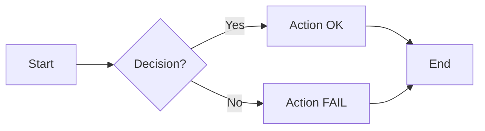

# archive-README
**Purpose:** code snippets and sections I'm working on

```mermaid
graph TD;
	A-->B;
	A-->C;
	B-->D;
	C-->D;
```

```mermaid
  flowchart LR    
  A[Start] --> B{Decision?};
  B -- Yes --> C[Action OK];
  B -- No  --> D[Action FAIL];
  C --> E[End];
  D --> E;
```